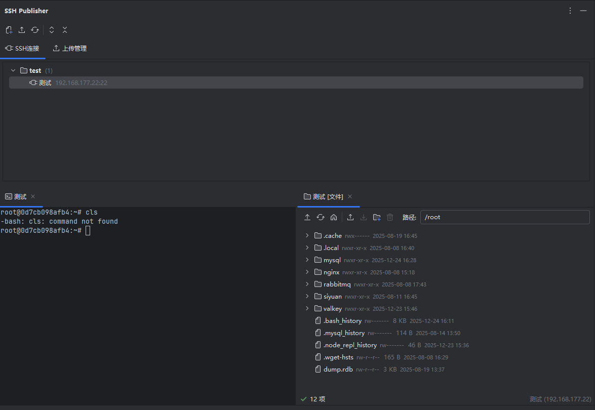
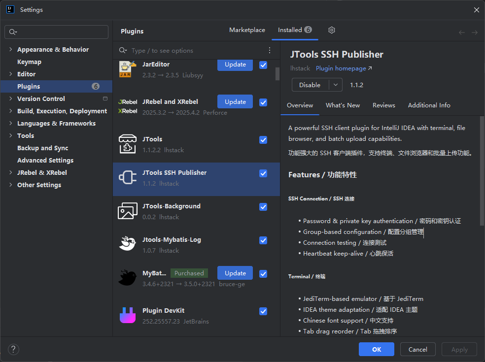

# SSH Publisher

[](https://plugins.jetbrains.com/)
[](LICENSE)

IntelliJ IDEA SSH 客户端插件，集成终端、文件浏览器和批量上传功能。

## ✨ 功能特性


### 🔐 SSH 连接管理
- 支持密码和私钥两种认证方式
- 配置分组管理，清晰组织多个服务器
- 连接测试，快速验证配置
- 心跳保活，防止连接超时断开

### 💻 SSH 终端
- 基于 JediTerm 的专业终端模拟器
- 自动适配 IDEA 明暗主题
- 完善的中文字体支持
- 多终端标签页管理
- **Tab 拖拽排序**
- **Tab 右键分屏**（向右拆分 / 向下拆分）

### 📁 文件浏览器 (SFTP)
- 远程文件系统浏览
- 文件/文件夹上传下载（**实时进度显示**）
- 新建文件夹、重命名、删除
- 文件属性查看（大小、权限、修改时间）
- 快速搜索定位文件
- 懒加载目录（展开时加载，提升性能）

### 📤 批量上传
- 同一文件上传到多台服务器
- 上传队列管理（进度、停止、重试、删除）
- 自定义远程文件名（解决中文乱码）
- 前置/后置脚本执行
- 每个服务器独立配置脚本
- 临时脚本支持（一次性执行）

## 📸 界面预览

```
┌─────────────────────────────────────────────────────┐
│ [+新建] [↑批量上传] [↻刷新] [展开] [折叠]           │
├───────────────┬─────────────────────────────────────┤
│               │                                     │
│  📁 SSH连接   │   🖥️ 终端 / 📂 文件系统              │
│  ├─ 生产环境  │                                     │
│  │  └─ web-1  │   ┌─────────┬─────────┐            │
│  │  └─ web-2  │   │ Tab 1   │ Tab 2   │  ← 支持分屏 │
│  └─ 测试环境  │   ├─────────┴─────────┤            │
│     └─ test   │   │                   │            │
│               │   │                   │            │
│  📤 上传管理  │   │                   │            │
│  └─ 任务列表  │   │                   │            │
│               │   └───────────────────┘            │
└───────────────┴─────────────────────────────────────┘
```

## 🚀 快速开始

### 添加 SSH 连接
1. 点击工具栏 **[+]** 按钮
2. 填写连接信息（名称、主机、端口、用户名）
3. 选择认证方式：
   - **密码认证**：输入密码
   - **密钥认证**：粘贴私钥内容
4. 点击「测试连接」验证
5. 保存配置

### 使用终端
- **双击** SSH 配置打开终端
- **右键 Tab** → 向右拆分 / 向下拆分
- **拖拽 Tab** 调整顺序

### 使用文件浏览器
- **右键** SSH 配置 → 文件系统
- **双击** 目录进入
- **工具栏** 上传/下载/新建文件夹

### 批量上传
1. 点击工具栏 **[批量上传]**
2. 选择本地文件
3. 勾选目标服务器
4. 点击服务器配置脚本（可选）
5. 添加到上传队列
6. 在「上传管理」查看进度

## 💾 数据存储

配置数据使用 SQLite 存储：
```
~/.jtools/jtools-ssh-publisher/db.data
```

## 🔧 构建

```bash
# 构建插件
./gradlew buildPlugin

# 产物位置
build/distributions/JTools-SSH-Publisher-*.zip
```

## 📦 安装

1. 打开 IDEA → Settings → Plugins
2. 点击 ⚙️ → Install Plugin from Disk...
3. 选择构建的 zip 文件
4. 重启 IDEA

## 📋 依赖

| 依赖 | 用途 |
|------|------|
| Apache MINA SSHD | SSH/SFTP 客户端 |
| SQLite JDBC | 数据存储 |
| JediTerm | 终端模拟 |

## 📄 License

[MIT License](LICENSE)

## 🤝 贡献

欢迎提交 Issue 和 Pull Request！


