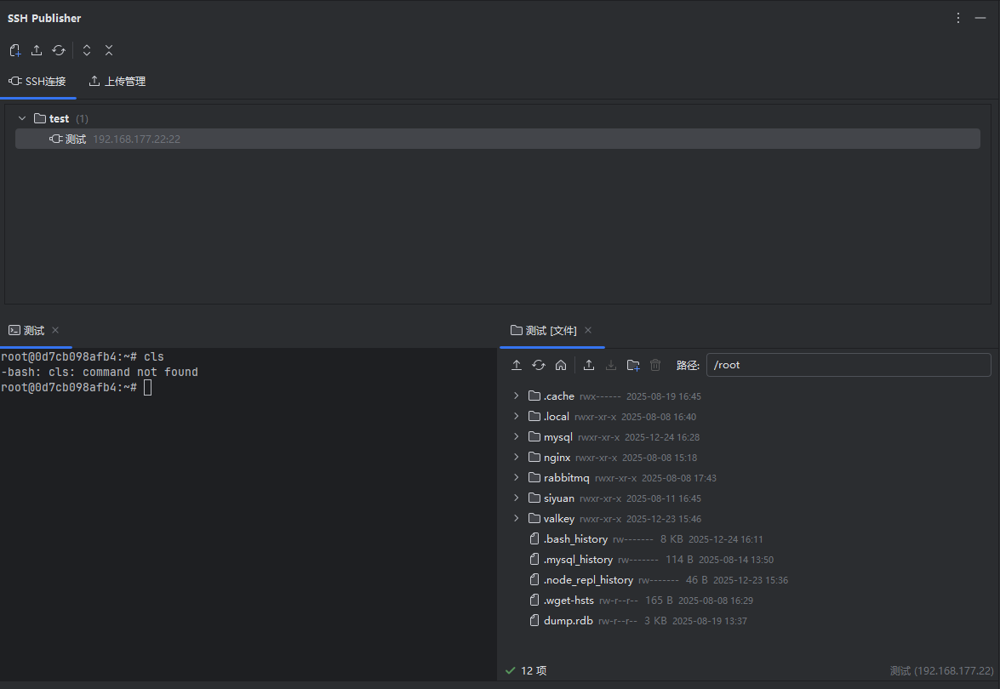
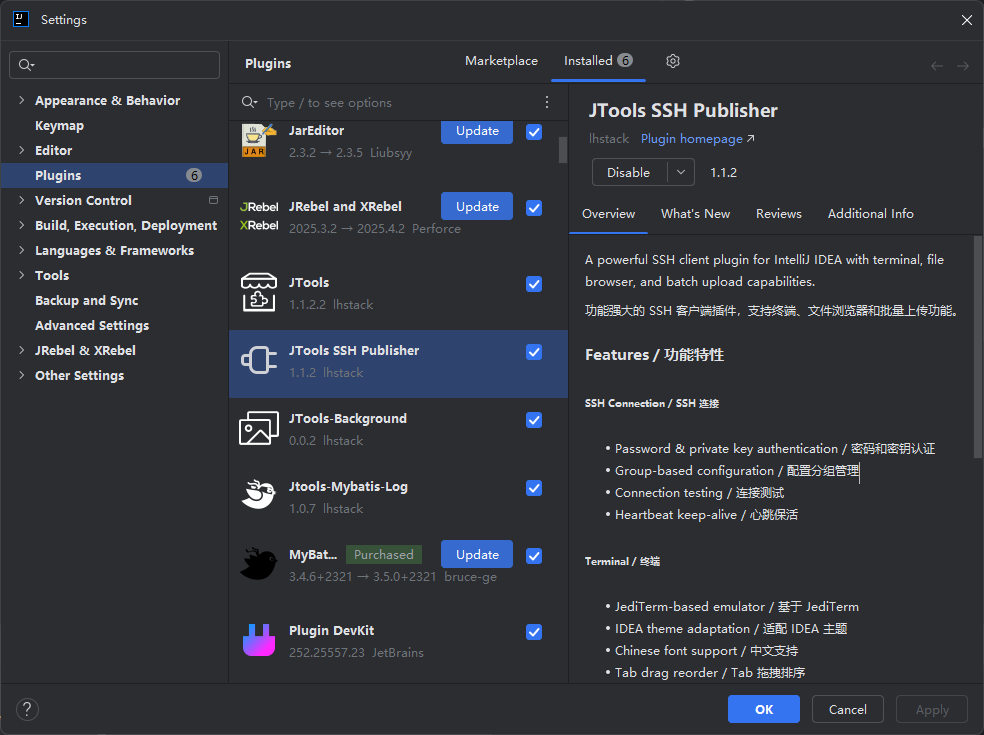

# SSH Publisher

[](https://plugins.jetbrains.com/)
[](LICENSE)

IntelliJ IDEA SSH 客户端插件，集成终端、文件浏览器和批量上传功能。

## ✨ 功能特性


### 🔐 SSH 连接管理
- 密码和密钥两种认证方式
- 支持使用本地默认密钥（~/.ssh/id_rsa）
- 支持从文件选择器加载任意密钥文件（PEM/二进制格式）
- **支持跳板链（Jump Host）**，可通过一台或多台跳板机连接目标服务器
- **连接右键菜单升级为 IDEA 原生动作菜单**，支持图标和操作搜索
- **SSH 分组支持右键新建配置与重命名**
- **支持查看并复制密码/私钥密码原文**，关闭后恢复安全掩码显示
- 连接测试
- 心跳保活，防止超时断开
- **前置/后置脚本配置**（列表+编辑器方式，方便编辑）
- **支持远程脚本和本地脚本**（远程经 SSH 在服务器执行，本地在本机执行）
- **非模态编辑对话框**（编辑时可同时进行其他操作）
- **SSH 配置编辑对话框表单对齐优化**
- **配置导出/导入**（支持全部导出或选择性导出）

### 💻 SSH 终端
- 基于 JediTerm 的专业终端模拟器
- 自动适配 IDEA 明暗主题
- 完善的中文字体支持
- **大文本粘贴稳定性增强**
- **支持 vi / less 等全屏程序窗口尺寸同步**
- **修复 macOS 输入法兼容问题**
- 多终端标签页管理
- **Tab 拖拽排序**
- **跨分屏容器 Tab 拖拽移动**（支持指定位置插入）
- **Tab 右键分屏**（向右拆分 / 向下拆分 / 取消分屏）
- **无限层级分屏**
- **基于焦点添加新 Tab**（点击或聚焦某个分屏容器后，新建的终端/文件系统会添加到该容器）
- 拖拽时目标容器高亮提示
- 分屏容器内所有 Tab 关闭后自动合并
- **底部系统监控状态栏**（CPU/内存/磁盘/进程数，每5秒刷新）

### 📁 文件浏览器 (SFTP)
- 远程文件系统浏览
- 文件/文件夹上传下载（**实时进度显示**）
- **文件系统右键菜单按目录、文件、多选状态动态展示操作**
- **批量上传到当前目录或所选目录**
- **支持拖拽本地单文件、多文件和目录到远程文件树递归上传**
- **支持远程文件树内拖拽移动文件和目录**
- **拖拽上传支持冲突检查与二次确认**
- **拖拽移动支持二次确认**
- **支持多选递归批量删除**
- **支持工具栏或目录右键新建/批量创建**
- **工具栏创建固定作用于当前所在目录**
- **目录右键创建直接作用于目标目录**，无需先双击进入
- **支持多级路径创建**（`a/b/c` 创建文件，`a/b/c/` 创建文件夹）
- **创建前会显示确认提示**，明确目标目录和待创建内容
- **删除前会根据风险级别显示增强提示**
- **右键支持打开、新建、批量创建、上传、编辑、下载、复制路径、属性、删除等操作**
- 重命名、删除
- **双击文件在 IDEA 编辑器中打开编辑**
- **保存时自动同步到远程服务器**（带通知提示）
- **连接断开时自动重连后同步**
- **支持 IDEA 本地历史记录（Local History）**
- 文件属性查看（大小、权限、修改时间）
- 快速搜索定位文件
- 懒加载目录（展开时加载，提升性能）
- **下载文件时检测重名**（支持覆盖/重命名/取消）
- **关闭文件系统 Tab 时自动关闭所有打开的远程文件编辑器**
- **底部系统监控状态栏**（CPU/内存/磁盘/进程数，每5秒刷新）

### 📤 传输管理
- **统一管理上传和下载任务**
- **每个任务使用独立 SSH 连接**（不影响终端和文件系统）
- 任务队列管理（进度显示、停止、重试、删除）
- **停止上传任务时自动删除远程未完成文件**
- **停止下载任务时自动删除本地未完成文件**
- **任务详情查看**（前置脚本、后置脚本、执行日志）
- 批量停止、清除已完成任务

### 📤 批量上传
- **多文件上传到多台服务器**
- **每个文件独立配置目标服务器**
- **每个文件独立配置远程路径和文件名**
- **每个文件独立配置前置/后置脚本（含本地脚本，工作目录为当前项目根目录）**
- 上传队列管理（进度、停止、重试、删除）
- 自定义远程文件名（解决中文乱码）
- 临时脚本支持（一次性执行）
- **本地脚本工作目录固定为当前项目根目录**

### 📋 上传模板
- **保存常用上传任务为模板，一键执行**
- **分组管理模板**
- **模板分组支持右键新建模板与重命名**
- 配置本地文件、目标服务器、远程路径
- 支持自定义远程文件名
- **支持选择服务器已配置的远程前置/后置脚本和本地前置/后置脚本**
- **支持临时脚本（仅本次执行）**
- **本地脚本工作目录固定为当前项目根目录**
- 双击模板快速执行
- **支持多选批量执行**
- 模板复制、编辑、删除
- **导出/导入时包含模板配置**

### 🚀 批量执行
- **按分组勾选多台服务器，并发执行同一份脚本**
- **每台服务器独立结果 Tab**，实时输出执行日志
- **分组级已保存脚本**，可新建、编辑、删除
- **已保存脚本支持上下排序**，多选后按顺序依次执行
- **实时脚本编辑器带 Shell 语法高亮**（一次性，不保存）
- **实时脚本可选在已保存脚本之前或之后执行**
- 一键全选、反选当前分组内的服务器
- 支持停止执行、清空结果
- **左右、上下分割线均可自由拖拽调整区域大小**
- 分组删除时，该分组的批量执行脚本级联删除

### ⚙️ 配置管理
- **导出配置**（全部导出或选择性导出）
- **导入配置**（支持覆盖或跳过已存在配置）
- **覆盖导入支持二次确认**
- **支持重命名 SSH 分组和上传模板分组**
- **刷新后保持展开状态**
- **上方面板支持收起/展开**（收起后下方面板自动撑满，并恢复上次分栏比例）

## 📸 界面预览

```
┌─────────────────────────────────────────────────────┐
│ [+新建] [↑批量上传] [↻刷新] [展开] [折叠] [导出] [导入] │
├───────────────┬─────────────────────────────────────┤
│               │                                     │
│  📁 SSH连接   │   🖥️ 终端 / 📂 文件系统              │
│  ├─ 生产环境  │                                     │
│  │  └─ web-1  │   ┌─────────┬─────────┐            │
│  │  └─ web-2  │   │ Tab 1   │ Tab 2   │  ← 支持分屏 │
│  └─ 测试环境  │   ├─────────┴─────────┤            │
│     └─ test   │   │                   │            │
│               │   │                   │            │
│  📋 上传模板  │   │                   │            │
│  └─ 模板列表  │   │                   │            │
│               │   │                   │            │
│  📤 传输管理  │   └───────────────────┘            │
│  └─ 任务列表  │                                     │
│               │                                     │
│  🚀 批量执行  │   （切到此 Tab 时占满整个面板）      │
│  └─ 勾选服务器│                                     │
└───────────────┴─────────────────────────────────────┘
```

## 🚀 快速开始

### 添加 SSH 连接
1. 点击工具栏 **[+]** 按钮
2. 填写连接信息（名称、主机、端口、用户名）
3. 选择认证方式：
  - **密码认证**：输入密码
  - **密钥认证**：粘贴私钥内容
4. 如需跳板，配置 **跳板链**（支持新增多台跳板机并按顺序连接）
5. 点击「测试连接」验证
6. 保存配置
7. 如需整理连接分组，可在左侧 SSH 分组节点上 **右键重命名**

### 使用终端
- **双击** SSH 配置打开终端
- **右键 Tab** → 向右拆分 / 向下拆分 / 取消分屏
- **拖拽 Tab** 调整顺序或移动到其他分屏容器
- **点击或聚焦** 某个分屏容器后，新建的终端会添加到该容器

### 使用文件浏览器
- **右键** SSH 配置 → 文件系统
- **双击** 目录进入
- **双击** 文件在 IDEA 编辑器中打开（保存自动同步）
- **工具栏** 上传/下载/新建/批量创建
- **右键菜单** 会根据当前选中的是目录、文件还是多选结果，动态提供对应操作
- **工具栏新建/批量创建**：始终基于当前路径栏所在目录
- **右键目录新建/批量创建**：直接基于被右键的目录，无需先双击进入
- **新建规则**：输入 `a/b/c` 创建文件，输入 `a/b/c/` 创建文件夹
- **批量创建**：每行一个路径，支持同时创建多级文件和文件夹
- **确认提示**：点击确认后会再次提示目标目录和待创建内容
- **拖拽上传确认**：拖拽本地文件/目录到远程树时，会先检查同名目标并提示 `覆盖上传 / 跳过冲突项 / 取消`
- **拖拽移动确认**：拖拽远程文件/目录到其他目录时，会先提示目标目录和待移动项
- **批量上传**：选中目录后点击工具栏 **[批量上传]**，或将本地文件/目录直接拖入远程文件树
- **批量删除**：使用 `Ctrl/Cmd` 或 `Shift` 多选文件/目录后右键删除
- **拖拽移动**：将远程文件或目录直接拖到另一个远程目录

### 下载文件
- **右键** 文件 → 下载
- 或选中文件点击工具栏 **[下载]** 按钮
- 本地存在同名文件时可选择：覆盖 / 重命名 / 取消
- 任务添加到「传输管理」队列

### 传输管理
- 查看所有上传/下载任务进度
- **停止**：中断任务并清理未完成文件
- **重试**：重新执行失败或已停止的任务
- **删除**：从列表移除任务
- **详情**：查看脚本内容和执行日志

### 批量上传
1. 点击工具栏 **[批量上传]**
2. 添加要上传的文件（支持多选）
3. 选择每个文件的目标服务器
4. 配置每个文件的远程路径和文件名
5. 点击服务器配置脚本（可选）
6. 设置临时脚本（可选）
7. 添加到传输队列
8. 在「传输管理」查看进度

### 上传模板
1. 切换到左侧 **[上传模板]** Tab
2. 点击 **[+]** 新建模板
3. 填写模板名称、分组
4. 选择本地文件
5. 选择目标服务器
6. 配置远程路径和文件名（可选）
7. 选择服务器脚本或编写临时脚本（可选）
8. 保存模板
9. **双击** 模板执行，或 **多选后点击「执行选中」** 批量执行
10. 如需整理模板分组，可在分组节点上 **右键重命名**

### 导出配置
1. 点击工具栏 **[导出配置]**
2. 选择「导出全部」或「选择导出」
3. 选择导出目录
4. 配置导出为 JSON 文件

### 导入配置
1. 点击工具栏 **[导入配置]**
2. 选择配置文件（JSON）
3. 选择覆盖或跳过已存在的配置
4. 选择覆盖时，会再次提示覆盖风险后才继续导入

## 💾 数据存储

配置数据使用 SQLite 存储：
```
~/.jtools/jtools-ssh-publisher/db.data
```

远程文件编辑缓存：
```
~/.jtools/jtools-ssh-publisher/{config-id}/...
```

## 🔧 构建

```bash
# 构建插件
./gradlew buildPlugin

# 产物位置
build/distributions/JTools-SSH-Publisher-*.zip
```

## 📦 安装

1. 打开 IDEA → Settings → Plugins
2. 点击 ⚙️ → Install Plugin from Disk...
3. 选择构建的 zip 文件
4. 重启 IDEA

## 📋 依赖

| 依赖 | 用途 |
|------|------|
| Apache MINA SSHD | SSH/SFTP 客户端 |
| SQLite JDBC | 数据存储 |
| JediTerm | 终端模拟 |

## 📝 更新日志

### v1.2.7
- 新增：批量执行面板，按分组勾选多台服务器并发执行脚本，每台服务器独立结果 Tab，支持全选/反选、停止和清空结果
- 新增：批量执行支持分组级已保存脚本，可新建、编辑、删除和上下排序，多选后按顺序依次执行
- 新增：批量执行的实时脚本编辑器带 Shell 语法高亮，可选择在已保存脚本之前或之后执行
- 新增：本地脚本体系，SSH 配置的脚本类型扩展为 `PRE` / `POST` / `LOCAL_PRE` / `LOCAL_POST`，本地脚本通过 `ProcessBuilder` 在本机执行
- 新增：本地脚本可指定 Shell，按当前操作系统自动探测可用 Shell（Windows 读 PATH 判断 PowerShell，macOS/Linux 读 `/etc/shells`）
- 新增：`TransferTask` 携带 `localWorkDir` 字段，本地脚本执行时工作目录固定为触发上传时的**当前项目根目录**（`project.basePath`），脚本内相对路径均以项目根目录为基准；覆盖全部四个上传入口：SSH 连接右键上传、批量上传、上传模板单次执行、上传模板多选批量执行
- 新增：SSH 分组改为独立分组表，支持重命名和删除分组，删除时组内连接归入「默认」、该分组的批量执行脚本级联删除
- 新增：SSH 连接树支持拖拽调整顺序，可拖到分组内末尾或插到指定连接前后并自动切换分组
- 优化：SSH 配置、右键上传、批量上传、上传模板的脚本区域改为可折叠区块，长表单不再被脚本编辑器挤占
- 新增：脚本选择表格增加「位置」列（本机 / 服务器）以区分执行环境
- 修复：右键上传弹窗、批量上传、上传模板的脚本列表只加载远程前置/后置脚本，已保存的本地前置/后置脚本无法勾选的问题
- 修复：切换到批量执行 Tab 时把分割线宽度设为 0 触发 `IllegalArgumentException` 导致面板加载失败的问题
- 修复：批量执行面板三条分割线因子组件最小尺寸限制几乎无法拖动的问题
- 修复：工作目录不可用时显式报错，不再静默回退到 IDE 进程目录
- 修复：所有本地 Shell（CMD、PowerShell、Bash、Zsh、sh 及系统默认 Shell）执行后，传输日志统一记录脚本输入、Shell 类型、工作目录、`stdout`、`stderr`、退出码和超时状态；无输出时也会明确标记，避免 Windows CMD 执行 `git status` 等命令后日志为空
- 修复：任一本地前置脚本返回非零退出码、执行超时或发生执行异常时，立即终止后续前置脚本和上传操作，并将传输任务标记为失败
- 修复：编辑上传模板时，已保存脚本表格的 Checkbox 偶发需要连续点击多次才能切换；现改为鼠标按下即直接更新 Boolean 模型，并同步应用到 SSH 连接右键上传和批量上传的同类脚本选择表格
- 优化：批量执行页面点击分组或该分组下任意服务器时，都会查询并回显所属分组的已保存脚本；切换同组服务器时保留仍有效的脚本选择

### v1.2.6
- 修复：SSH 配置与跳板机勾选「显示原文」后，密码和私钥密码无法通过 `Ctrl/Cmd + C` 快捷键复制的问题
- 优化：明文状态使用普通文本框，关闭「显示原文」后恢复密码框；两种输入框共享内容，切换时保留文本、光标位置和选区
- 修复：新增「显示原文」选项后私钥输入区域被尾部复选框挤窄的问题，恢复私钥区域完整宽度

### v1.2.5
- 优化：Tab 拖拽体验重构，拖出即从源分屏移除并跟随鼠标显示半透明幽灵标签，落点显示高亮占位标签，同容器排序与跨容器移动统一逻辑
- 修复：Tab 拖拽排序时因反复重算落点导致的闪烁问题
- 优化：Tab 右键菜单切换为 IDEA 原生动作弹窗，支持图标与操作搜索
- 优化：全量重绘工具栏、文件类型、状态、分屏等图标，统一为 IDEA 风格线性图标并适配明暗主题
- 新增：SSH 主机密钥校验（known_hosts + 首次指纹确认 + 指纹变化告警），防止中间人攻击
- 新增：SSH 配置与跳板机的密码、私钥密码支持「显示原文」，免去导出核对
- 优化：命令执行改为并发读取 stdout/stderr，避免管道阻塞与输出截断
- 优化：SFTP 客户端与配置存储的并发访问串行化，避免多线程共享导致的错乱
- 修复：终端断线重连按钮监听重复注册导致的多次触发
- 修复：传输任务停止时可能覆盖已完成状态的问题
- 修复：shadowJar 打包因 MANIFEST.MF 输入快照失败的问题

### v1.2.4
- 优化：SSH 配置、上传模板、文件系统右键菜单统一切换为 IDEA 原生动作弹窗，支持图标展示与操作搜索
- 新增：SSH 连接分组支持右键重命名，并可直接在分组下新建配置
- 新增：上传模板分组支持右键重命名，并可直接在分组下新建模板
- 优化：文件系统右键菜单按当前选择动态展示打开、新建、批量创建、上传、编辑、下载、复制路径、属性、删除等操作
- 修复：SSH 配置编辑对话框中标签与表单内容未对齐的问题

### v1.2.3
- 新增：远程文件树内拖拽移动支持二次确认，避免误移动文件和目录
- 新增：本地拖拽上传到远程目录时支持同名冲突检查，并可选择覆盖上传、跳过冲突项或取消
- 新增：导入配置选择“覆盖”时增加二次确认，明确脚本和模板引用的覆盖风险
- 优化：远程文件和目录删除提示增强，明确递归删除与不可恢复风险
- 优化：SSH 配置删除和上传模板删除提示增强，明确删除影响范围

### v1.2.2
- 新增：文件系统目录右键支持新建和批量创建
- 新增：新建支持多级路径，输入 `a/b/c` 创建文件，输入 `a/b/c/` 创建文件夹
- 新增：批量创建支持多行输入，可同时创建文件和文件夹并自动补齐父目录
- 优化：工具栏创建入口调整为「新建 / 批量创建」，并固定作用于当前所在目录
- 优化：目录右键创建直接作用于目标目录，减少进入目录后的重复操作
- 优化：创建前增加确认提示，明确目标目录和待创建内容

### v1.2.1
- 新增：SSH 配置支持跳板链（Jump Host），可通过一台或多台跳板机连接目标服务器
- 新增：跳板链支持密码认证、私钥认证和本地默认密钥认证
- 新增：SSH 配置编辑对话框支持新增、编辑、删除、上下调整跳板机顺序
- 新增：上方面板支持收起/展开，展开时恢复上次分栏比例
- 优化：收起上方面板时自动隐藏无效工具栏按钮，仅保留右上角展开入口
- 优化：统一整理项目内图标资源，提升工具栏、Tab、文件系统和传输管理的识别度
- 修复：跳板连接时本地端口转发取值错误导致的 `Invalid port: 0` 问题
- 修复：跳板连接失败时错误信息过于模糊的问题，现可显示具体跳数和失败阶段

## 📄 License

[Apache2.0 License](./LICENSE)

## 🤝 贡献

欢迎提交 Issue 和 Pull Request！


